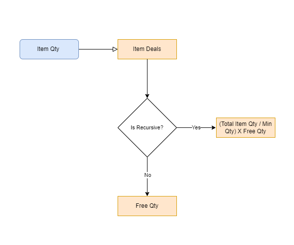
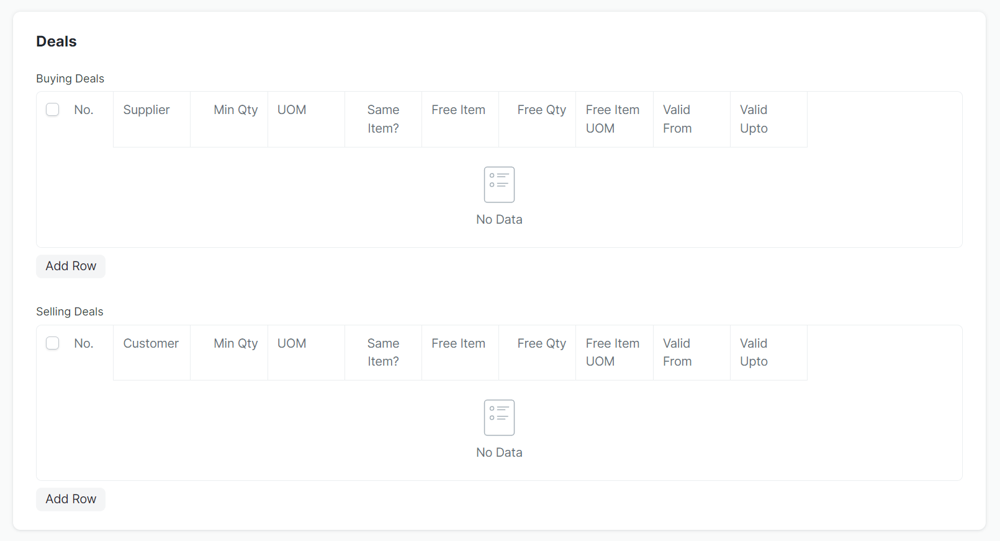

# 1 Overview

Deals, available in both purchasing and selling transactions, enables users to add or remove free items linked to existing items in the Item table. Selling and purchasing deals are conveniently managed within the Item profile itself.

Item deals are automatically applied based on the quantity of each item within a transaction.


Note: All current deals are set to recursive by default at the moment. 

# 2 Maintenance

## 2.1 Child DocTypes

Deals are maintained in the Item profile and are separated by two types of deals. These are the the Selling Deals and the Buying Deals. 



The following fields are typically stored in these child DocTypes:

- Supplier (`supplier`): Link to Supplier. (Buying Deals only)
- Customer (`customer`): Link to Customer. (Selling Deals only)
- Min Qty (`min_qty`): Minimum Quantity for the deal to apply.
- UOM (`uom`): UOM of the parent item.
- Same Item? (`same_item`): Check (If the free item is the same with the parent item)
- Free Item (`free_item`): If `Same Item?` is checked this field is automatically set to the parent item other wise. Link to Items.
    > For buying it is filtered based on what items maintain that specific supplier. 
- Free Qty (`free_qty`): The qty of free item involved in the deal.
- Free Item UOM (`free_item_uom`): The uom of free item involved in the deal.
- Valid From (`valid_from`): Date
- Valid Upto (`valid_upto`): Date

Currently, the following are the child DocTypes for deals:

- Item Buying Deals
- Item Selling Deals

## 2.2 Validations

Frontend and backend validations are present to validate values upon entering as well as as upon saving. 

### 2.2.1 Item Deals Validation

```python


class Item(WebsiteGenerator):
    def validate(self):
        self.validate_deals()

     def validate_deals(self):
        for deal in self.buying_deals:
            deal.validate(self)

        for deal in self.selling_deals:
            deal.validate(self)
```

```python 
class ItemSellingDeal(Document):
    def validate(self, item):
        # validates qty (if qty greater than 0)
        # validates uom (if UOM is maintained in the parent item)
        # validates the item (if there is an item entered in the field)
        # validates the free item uom (if the free item UOM is maintained in the free item's profile)
```

```python 
class ItemBuyingDeal(Document):
    def validate(self, item):
        # validates the supplier (if supplier is maintained in the item profile)
        # validates qty (if qty greater than 0)
        # validates uom (if UOM is maintained in the parent item)
        # validates the item (if there is an item entered in the field)
        # validates the free item uom (if the free item UOM is maintained in the free item's profile)
```

On Item.js the quantities are validated upon enter. 
```javascript
frappe.ui.form.on("Item Selling Deal", {
        free_qty: async function (frm, cdt, cdn) {
            await validate_for_negative_qty(frm, cdt, cdn, "free_qty"); 
        },
        min_qty: async function (frm, cdt, cdn) {
            await validate_for_negative_qty(frm, cdt, cdn, "min_qty");
        },
});
```


## 2.3 Pricing Rule Controller

The pricing rule controller operates similarly to the discount controller. It utilizes the same code, workflow, and processes. For further details on the pricing rule controller, please refer to section 2.3, "Pricing Rule Controller," in the discount documentation: link to documentation: <a href="https://bizkit-tech.github.io/docs/projects/discounts/#23-pricing-rule-controller"> https://bizkit-tech.github.io/docs/projects/discounts/#23-pricing-rule-controller</a>.

# 3 Application To Transactions

Item deals are appear when you add an item into the items table of a certain transaction. The intial application of a deal is when an Item Code is entered and since it always defaults to one, it then checks for a deal that applicable to the item. This happens through an API call. 

There is only one touchpoint on a deal application. This is when an 

1. Item Code in the Items table is changed

   Inside the `item_code` form event of `erpnext.TransactionController`, the `apply_item_deals` function of the `erpnext.TransactionController` class is called after the item details are fetched from the server call.
   ```js
   apply_item_deals: function (item) {
		if (
			!in_list(
				[
					"Sales Order",
					"Delivery Note",
					"Sales Invoice",
					"Purchase Order",
					"Purchase Receipt",
					"Purchase Invoice",
				],
				this.frm.doc.doctype
			) ||
			item.is_free_item
		)
			return;
		return frappe
			.call({
				method: "erpnext.controllers.item_deals.apply_item_deals",
				args: {
					item: item,
					doc: this.frm.doc,
				},
			})
			.then((r) => {
				if (r && r.message) {
					if (!r.message) return;
                     // will get all the free items
					const items = this.get_free_items(this.frm);
                    // will get all the non free items
					const exist_items = items.map(
						(row) => (row.item_code, row.free_item_pricing_rule) 
					);
					const price_rules = r.message;                                  

					let free_item_qty = {}; 
                    //   structure of free_item_qty
                    //   {"pricing_rule": qty}
                    //   i.e. { "item-000001-pricing-rule-1" : 20}


					price_rules.forEach((free_item) => {
						let row_to_modify = {};
						let qty = 0;
                        // check check if free item does not exist in the current table
						if (                                                     
							!items ||
							!in_list(
								exist_items,
								(free_item.item_code,
								free_item.free_item_pricing_rule)
							)
						) {
                            // add child to serve as holder of the free item
							row_to_modify = frappe.model.add_child(           
								this.frm.doc,
								this.frm.doc.doctype + " Item",
								"items"
							);
							qty = free_item["qty"];

						} else if (items) {     

                            // if item is existing it will then find that item and modify
                            // the respective values   
                                                        
							row_to_modify = items.find(                            
								(d) =>
									d.item_code === free_item.item_code &&
									d.free_item_pricing_rule ===
										free_item.free_item_pricing_rule
							);
                            // incase of a qty change we subtract the qty of the current free item to the to be modified row
							qty = free_item["qty"] - row_to_modify["qty"];    
						}                                                          
                        
						if (qty)
							free_item_qty[free_item.free_item_pricing_rule] =
								qty;

						for (let key in free_item) {
							row_to_modify[key] = free_item[key];
						}
                        // removes the free item if qty us 0 
						if (row_to_modify["qty"] == 0)
                            //uses clear_doc to avoid triggering other frm events
							frappe.model.clear_doc(
								row_to_modify["doctype"],
								row_to_modify["name"]
							);
					});
					if (price_rules) {
						frappe.model.set_value(
							item.doctype,
							item.name,
							"free_item_pricing_rule",
							JSON.stringify(free_item_qty)
						);
					}

					this.frm.refresh_field("items");
				}
			})
			.then(() => {
				erpnext.item_deals.disable_free_item_rows(this.frm);
			});
	},
   ```
   Note: Only non-free items that the deal is applied to, uses the `free_item_pricing_rule` field.

    The functions found on `item_deals.py` are responsible for retrieving the applicable pricing rule for each item. An SQL query fetches the relevant pricing rules (deals) that meet specific conditions based on the provided item parameter. However, potential duplicates within the Items Table must be considered. To accurately accumulate the total quantity for each unique item, the entire table is passed as a parameter to the function. For each duplicate item, the corresponding pricing rule is fetched individually, and the quantity of the free item is added to the original free item's quantity. The function then returns the pricing rule, along with other relevant fields needed in creating a row and the accumulated quantity of the free item.

  

2. Qty in the Items table is changed

   When the quantity changes in any transaction document, the `apply_item_deals` function within the `erpnext.TransactionController` class is automatically triggered.

    ```js
    erpnext.TransactionController = erpnext.taxes_and_totals.extend({
        qty: function (doc, cdt, cdn) {
            let item = frappe.get_doc(cdt, cdn);
            ...
            frappe.run_serially([
                ...
                () => this.apply_item_deals(item),
                ...
            ])
        }
    });
   ```

3. Removal of Items in the Items table

    Before an item is removed from the Items table, the `before_items_remove` event is triggered. This event runs the `remove_item_deals` function, which removes all associated deals from the item. Note that this function only triggers for the removal of non-free items, as free item removal uses `frappe.model.clear_doc`.

    ```js
        frappe.ui.form.on("Sales Invoice Item", {
            before_items_remove: (frm, cdt, cdn) => {
                const item = frappe.get_doc(cdt, cdn)
                return new Promise((resolve) => {
                    if (!item.is_free_item && item.free_item_pricing_rule){
                        erpnext.item_deals.remove_item_deals(frm, item)
                    }
                    resolve()
                })
            },

        });
    ```

    ```js
        erpnext.item_deals.remove_item_deals = (frm, item) => {
            const list_deals = JSON.parse(item.free_item_pricing_rule)
            for(var key in list_deals){
                const row = frm.doc.items.find((d) => d.free_item_pricing_rule === key)
                if (!row) return;
                const final_qty = row.qty - list_deals[key]
                if(final_qty <= 0){
                    frappe.model.clear_doc(row.doctype, row.name)
                }else{
                    frappe.model.set_value(row.doctype, row.name, "qty", final_qty)
                }
            }
        };
   ```
    > This fucntion both serves as free item remover and qty updater. 

# 4 Limitation
1. One great challenge we faced when developing this feature was handling Item Code changes when an existing deal was applied to the original code. To address this, we initially implemented a process that reapplied deals to all items in the Items Table whenever an Item Code changed. However, this caused significant performance issues, so we had to revert to a previous approach. Unfortunately, due to limitations in accessing the original Item Code before the change, we cannot automatically adjust the quantity of free items associated with it. As a temporary solution, users will need to manually remove these items.

# 5 Recommendations

1. As you can see in the limitations, there are certain scenarios this feature doesn't handle. This makes it prone to human error and potential business problems. For future development, I recommend implementing a function that runs scripts before changes occur. This function could be named `before_change` and be widely applicable across different document types and functions. This would be highly beneficial for features like this one, where the pre-change value of a field is crucial.

# 6 Developer's Note
1. This feature is a treasure trove for grid manipulation. Struggling with table grids? Give the related code a peek! It might just hold the solution you've been searching for.