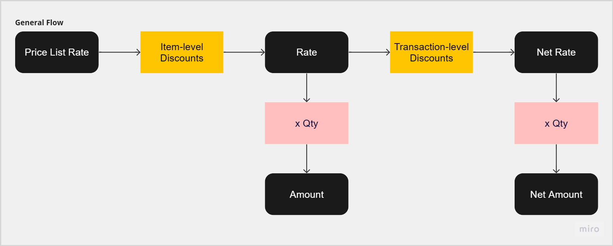

# 1 Overview

Discounts are a crucial feature in purchasing and sales transactions. It enables the users to configure item rates more flexibly according to multiple factors. Discounts are maintained and are associated with the following master data DocTypes:

- Item
- Supplier
- Customer

Item discounts are discounts applied to the Price List Rate of each item in a transaction. Supplier, Customer, and Principal discounts are discounts applied to the whole transaction, distributed among the items' Rates.



# 2 Maintenance

## 2.1 Child DocTypes

Discounts are maintained in the master data associated with them as a child table. They are generally separated into two child tables: Buying Discounts and Selling Discounts, depending on which ones are applicable to the DocType.

The following fields are typically stored in these child DocTypes:

- For Price List (`for_price_list`): Link to Price List
- Supplier (`supplier`): Link to Supplier (hidden for Supplier discounts)
- Supplier Name (`supplier_name`): Supplier Name fetched from the `supplier` linked (hidden for Supplier discounts)
- Discount Type (`discount_type`): Select field (Compounding, On Total)
- Discount Percentage (`discount_percentage`): Float
- Valid From (`valid_from`): Date
- Valid Up To (`valid_upto`): Date

Currently, the following are the child DocTypes for discounts:

- Item Buying Discounts
- Item Selling Discounts
- Supplier Buying Discounts
- Customer Selling Discounts
- Principal Buying Discounts

## 2.2 Validations

Validations should be put in place to make sure that only valid values are entered in the fields.

### 2.2.1 Item Discounts

For Item Discounts, the validation of Buying and Selling Discounts are separated into two functions/methods:

```python
from erpnext.selling.utils import validate_selling_discounts

class Item(WebsiteGenerator):
    def validate(self):
        self.validate_item_buying_discounts()
        validate_selling_discounts(self)

    def validate_item_buying_discounts(self):
        ...
        # Validate that percentages are between 0 and 100
        # Validate that valid_upto > valid_from
```

## 2.2.2 Supplier Discounts

For Supplier Discounts, only Buying Discounts are available:

```python
class Supplier(TransactionBase):
    def validate(self):
        self.validate_supplier_buying_discounts()

    def validate_supplier_buying_discounts(self):
        ...
        # Validate that percentages are between 0 and 100
        # Validate that valid_upto > valid_from
```

## 2.2.3 Customer Discounts

For Customer Discounts, only Selling Discounts are available:

```python
from erpnext.selling.utils import validate_selling_discounts

class Customer(TransactionBase):
    def validate(self):
        validate_selling_discounts(self)
```

## 2.2.4 Principal Discounts

For Principal Discounts, only Buying Discounts are available:

```python
class Principal(Document):
    def validate(self):
        self.validate_discounts()

    def validate_discounts(self):
        for item in self.buying_discounts:
            item.validate_discount_values()

class PrincipalBuyingDiscount(Document):
    def validate_discount_values(self):
        # If discount is Actual on Total, checks if discount amount is not negative
        # If discount is On Total, Compounding, checks if discount percentage is not negative
```

## 2.3 Pricing Rule Controller

Pricing Rule is another DocType in ERPNext. Pricing Rules are a way to modify the rates and/or quantities of items. When the discounts are saved on the master data, Pricing Rules corresponding to these discounts are created or updated (the same way Item Price documents are created/updated). The discounts are not stored in the master data's child table itself, but in their own Pricing Rule documents.

The functions necessary for the interaction between the master data DocTypes and the Pricing Rules are inside the `pricing_rule_controller.py` file.

There are three functions inside the file that are called inside the parent DocType classes:

1. `load_pricing_rules`

   Discounts are not actually stored inside child tables of the master data, and instead are stored in Pricing Rule documents. When a master data document is loaded, the discounts are loaded into the corresponding child tables from the Pricing Rules.

   This function is called in the `onload` controller of the parent DocType.

2. `setup_pricing_rules`

   This function calls the `set_pricing_rules` function to check for changes in the discounts child table/s and identifies the corresponding Pricing Rules to be added, updated, or deleted. After that, it calls the `clear_pricing_rules` to clear the child table/s of the parent DocType so it remains empty.

   This function is called in the `before_save` controller of the parent DocType.

3. `update_pricing_rules`

   The Pricing Rules associated with the discounts to be added, updated, and deleted identified in the `setup_pricing_rules` call are added, updated, and deleted through this function.

   This function os called in the `on_update` controller of the parent DocType.

# 3 Application To Transactions

Currently, item-level and transaction-level discounts are applied to the following transactions:

- Purchase Order
- Purchase Invoice
- Purchase Receipt
- Sales Order
- Sales Invoice
- Delivery Note

Item-level discounts are shown in the Items child table. They are itemized inside the Configure Discounts modal triggered by the Configure Discounts button (`configure_discounts`) in the same row or item row form. The discount percentages of the item-level discounts are concatenated inside the Discounts Applied field (`discounts_applied`), and the combined difference between the Price List Rate and the Rate are stored in the Discount Percentage (`discount_percentage`) and Discount Amount (`discount_amount`) fields.

Transaction-level discounts have their own dedicated child table inside transactions. While there are only two options for the Discount Type when maintaining the transaction-level discounts in the master data DocTypes (i.e., On Total, Compounding), within transactions, the user can select another Discount Type for transaction-level discounts: Actual on Total.

When the Discount Type selected is either On Total or Compounding, the Discount Percentage is editable while the Discount Amount is disabled. The inverse is true for when the selected Discount Type is Actual on Total.

The following discounts are item-level discounts and are found in the Items child table within a transaction:

- Item Buying Discounts
- Item Selling Discounts

The following discounts are transaction-level discounts and are found in the Transaction Discounts child table within a transaction:

- Supplier Buying Discounts
- Customer Selling Discounts
- Principal Buying Discounts

There are multiple touchpoints on a transaction for discounts:

1. Item Code in the Items table is changed

   Inside the `item_code` form event of `erpnext.TransactionController`, the `calculate_item_discounts` function of the `erpnext.TransactionController` class is called after the item details are fetched from the server call.

   Within the same `item_code` form event, the `price_list_rate` form event is also triggered.

2. Price List Rate in the Items table is changed

   Inside the `price_list_rate` form event of `erpnext.buying.BuyingController`, if the document is one of the following, it will call on `display_transaction_discounts` under `erpnext.multiple_discounts`:

   - Purchase Order
   - Purchase Invoice
   - Purchase Receipt
   - Supplier Quotation

   ```js
   price_list_rate: function (doc, cdt, cdn) {
       ...
       if (in_list(["Purchase Order", "Purchase Invoice", "Purchase Receipt", "Supplier Quotation"], this.frm.doc.doctype)) {
           erpnext.multiple_discounts.display_transaction_discounts(this.frm);
       }
   ```

   Then under `erpnext.multiple_discounts`, it will call on the `get_transaction_discounts` method from the `discounts_controller` on the backend:

   ```js
   frappe.call(
     "erpnext.controllers.discounts_controller.get_transaction_discounts",
     {
       doc: frm.doc,
     }
   );
   ```

   And finally under `get_transaction_discounts`, it finds the respective Pricing Rules that are classified as "Transaction" for Supplier Discounts, and "Principal" for Principal Discounts using an SQL query:

   ```python
   @frappe.whitelist()
   def get_transaction_discounts(doc):
        ...
        # Selects enabled pricing rules that are labelled "Transaction" and "Principal" under the specified Supplier
        # For principal discounts, adds another query to filter the principals based on the specified Principal
        # Returns the transaction discounts in a form of a dict
   ```

3. Qty in the Items table is changed

   When the item quantity is changed, the `calculate_item_discounts` form event and `erpnext.multiple_discounts.display_transaction_discounts` public function are triggered:

   ```js
   erpnext.TransactionController = erpnext.taxes_and_totals.extend({
       qty: function (doc, cdt, cdn) {
           let item = frappe.get_doc(cdt, cdn);
           ...
           frappe.run_serially([
               () => this.calculate_item_discounts(item),
               ...
               () =>
   				erpnext.multiple_discounts.display_transaction_discounts(
   					this.frm
   				),
           ])
       }
   });
   ```

4. Transaction Discounts are updated

   In each form script file of the transaction DocTypes that discounts are applied, there is a form script for the Buying/Selling Transaction Discounts. This is where the transaction discounts are maintained within each transaction:

   ```js
   frappe.ui.form.on("Buying Transaction Discounts", {});
   ```

   Transaction discounts are recalculated when transaction discounts here are updated.

5. Supplier/Principal is changed after updating the Transaction Discounts

   It will remove the respective discounts that were previously applied, then would fetch the new set of Transaction Discounts based on the given Supplier/Principal using `display_transaction_discounts`

   ```js
   erpnext.buying.BuyingController = erpnext.TransactionController.extend({
     principal: async () => {
        frappe.run_serially([
            () =>
                erpnext.multiple_discounts.remove_other_principal_transaction_discounts(
                    this.frm
                ),
            () =>
                erpnext.multiple_discounts.remove_other_supplier_transaction_discounts(
                    this.frm
            ),
            () =>
                erpnext.multiple_discounts.display_transaction_discounts(this.frm);
        ]);
     },

     supplier: async () => {
        // similar to principal implementation
     }
   });
   ```

# 4 Recommendations

1. As you can see in [Validations](), there is a `validate_selling_discounts` function that is used by the Item Selling Discounts and Customer Discounts. However, the validations for the Item Buying Discounts and Supplier Discounts are methods of their respective parent DocType classes. One thing we can do to further clean the validations is to put all validations in one function since they're all validating percentages and dates anyway.
