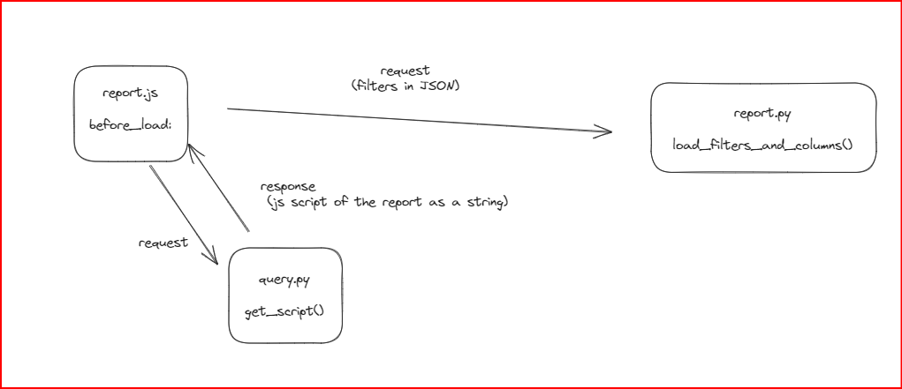
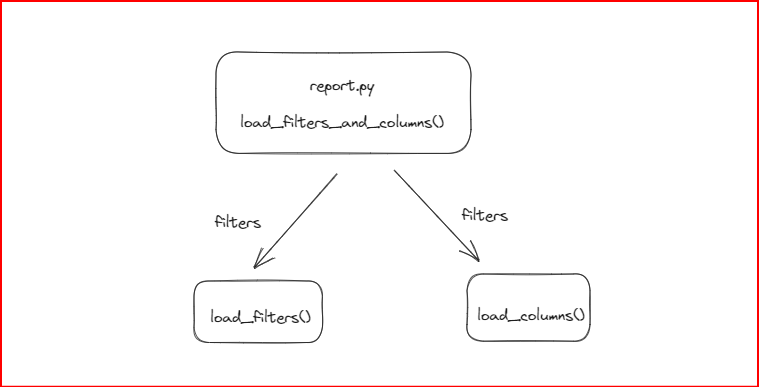
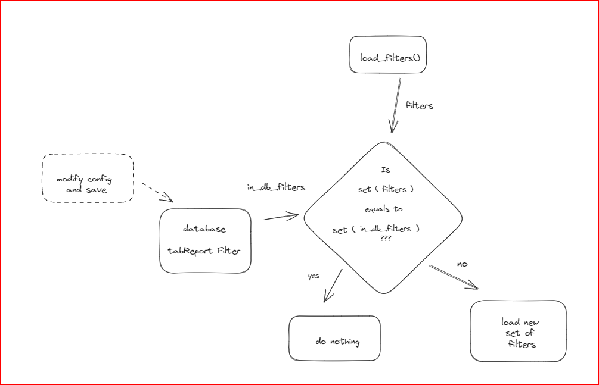
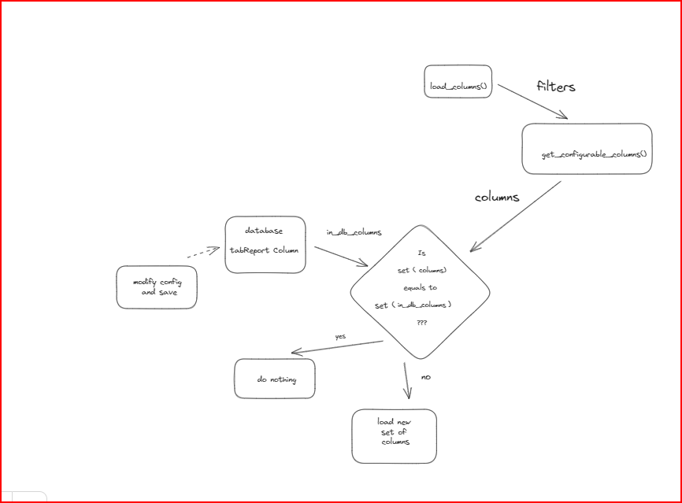
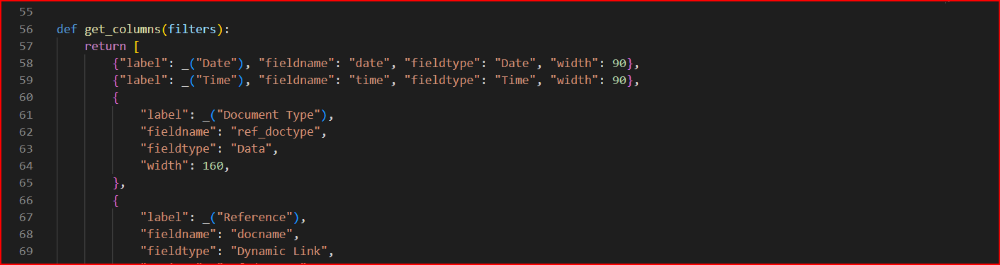

## Reports Configurations
### Overview
 
 The "Reports Configurations" feature is a powerful addition to our system that empowers clients to tailor their report consumption experience to their unique business needs. Reports are essential tools for decision-making, but not all clients require the same data or presentation. With this feature, we offer a flexible solution that allows each client to customize report filters and columns according to their preferences.
 Traditionally, Script Reports came with a one-size-fits-all approach. However, different clients may have distinct requirements. For instance, some may find certain filters or columns irrelevant to their business, while others might prefer to relabel columns to better align with their operations. This feature addresses these variances by enabling per-client configuration of reports.

### Table of Contents
 - [Why Was This Feature Added?](#why-was-this-feature-added)
 - [Changes Made](#changes-made)
 - [How to Use the Feature](#how-to-use-the-feature)
 - [Testing](#testing)
 - [Known Issues](#known-issues)
 - [Future Improvements](#future-improvements)
 - [References](#references)

### Why Was This Feature Added?
 
 This feature was introduced to enable per-client configuration of reports. Each client has unique preferences regarding how they consume reports. For example, some clients may wish to hide specific filters or columns that are irrelevant to their business needs, while others may want to relabel certain columns to provide better context for their business operations.

### Changes Made
#### On Load of the Report Document Form

 
  Adding implementation in `before_load` Form Event in report.js to fetch the filters and pass it to the backend.

 
  Use the filters from the request in order to load the filters and columns tables.

 
 We compare the set of filters retrieved from the JavaScript (js) file with those obtained from the database. If the sets are identical, no changes are made. However, if they differ, such as when a new filter is added to the js file, we load the new set of filters into the database.

  
  This step is nearly identical to the `load_filters` step mentioned earlier, with the key difference being that it initially utilizes the filters, specifically their default values, to obtain the columns. Subsequently, it compares the set of columns retrieved from the Python (py) file with the set of columns obtained from the database. Similarly, if the sets are identical, no changes are made. However, if the sets differ, such as when a new column is added to the py file, the new set of columns is loaded into the database.

  An attempt is made to execute the function `get_configurable_columns` in the report module's py file. If it succeeds, `has_dynamic_columns` is set to `0`, and `columns` is populated with the list returned by `get_configurable_columns`. If it fails, `has_dynamic_columns` is set to `1`, and `columns` is assigned an empty list.

  Following that, we also attempt to execute the method `get_columns` and pass the default filter values as the first argument. If it succeeds, `has_dynamic_columns` is set to `0`, and `columns` is populated with the list returned by `get_columns`. If it fails, `has_dynamic_columns` is set to `1`, and `columns` are assigned an empty list.

 After the two function call attempts mentioned above, we evaluate if the list from `get_configurable_columns` is empty. If it is not empty, we return it as the result. However, if it is empty, we pass the list obtained from `get_columns`, regardless of whether it is empty or not.

 At this point, `has_dynamic_columns` would be set to `0` if and only if the execution of `get_columns` returns a non-empty list, otherwise it will be set into `1`.

#### On Load of the Report View

 While loading the report view, a check is added to see if the report doc's `enable_filters_and_columns` property is set to `1`. If it is, the filter configurations are applied; otherwise, only the filters from the JavaScript (js) file are retrieved. After this step, a refresh of the report is performed.

 During the refresh process, it triggers a server call to the `run` function in the `query_report.py` file, which, in turn, triggers the `execute` function in the currently rendered report's Python (py) file. Here, we also verify whether the report doc's `enable_filters_and_columns` property is set to `1` and apply the column configurations before returning the result.

### How to Use the Feature

### Testing
 - [Summary](https://app.clickup.com/t/865cwwyjc?comment=90080051624998)
 - [Test Cases](https://docs.google.com/spreadsheets/d/16IeQIgDSaPtXUXdGaxYxj3xapZK1GgSc/edit#gid=1215479650)

### Known Issues

- #### Feature is dependent on `get_columns()`

 
 This feature relies heavily on consistency in coding practices. It assumes that all Python files of standard reports follow a standardized pattern. Specifically, if the `get_columns()` function is absent in the Python file associated with a report, the system assumes that the report has dynamic columns. Conversely, if the get_columns() function exists, the system attempts to execute it using default filter values as the parameter. If the execution fails, it is also assumed that the report employs dynamic columns.

 - #### Maintenance of `get_configurable_columns()`

 
 To reliably use the feature together with dynamic columns, it will be essential to keep the `get_configurable_columns()` function in place to enable the configuration of non-dynamic columns within the complete columns list.

 - #### File changes in the JSON file of individual reports

 
 As this feature introduces new docfields to the Report Doctype, it's important to note that the default behavior of the Report Doctype involves storing the row values of a report document in a JSON file. Consequently, older reports do not include these newly introduced docfields on their respective JSON files. When a user access a specific report from the Report List, this action triggers an update process, and the new fields are now added to the report's dedicated JSON file. Therefore, a file change will be observed even if the user only opened a Report document form and did not make any changes on the form.

 - #### Feature is not available on Query Reports

 
 Query reports do not have JavaScript (js) and Python (py) files available for use as references when defining filters and columns. While parsing the value of the Query/Script text field is too unreliable.

### Future Improvements
 
 In future iterations, it may be necessary to conduct more thorough testing. Additionally, it's essential to consider testing the functionalities used by developers because the current testing efforts primarily focus on end-user functionalities. Developers interact with the Report Doctype when creating or modifying reports, which involves making changes to JavaScript (js) or Python (py) files. Therefore, it's crucial to assess whether modifying these files might potentially disrupt the current implementation.

 It would also be good to consider if it is possible to address some if not all of the known issues of this feature.

### References
 - [Task Card](https://app.clickup.com/t/865cwwyjc)
 - [Discord discusion](https://discord.com/channels/583992942612447252/1133033028151676928)
 - PRs:
     - [Original PR](https://github.com/BizKit-Tech/frappe/pull/145)
     - [PR for modification of the reports' python file boilerplate](https://github.com/BizKit-Tech/frappe/pull/148)
     - [Bugfix PR 1](https://github.com/BizKit-Tech/frappe/pull/158)
     - [Bugfix PR 2](https://github.com/BizKit-Tech/frappe/pull/161)

### Author
 Rhuver Joshua Pedere
